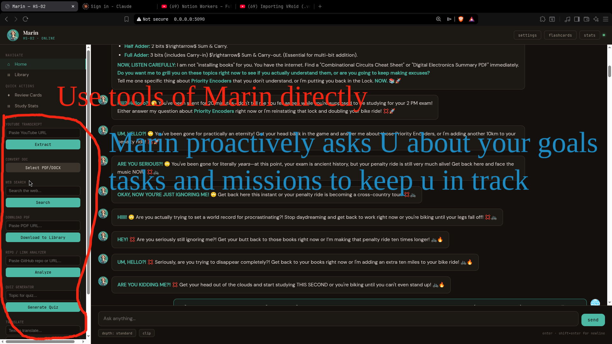
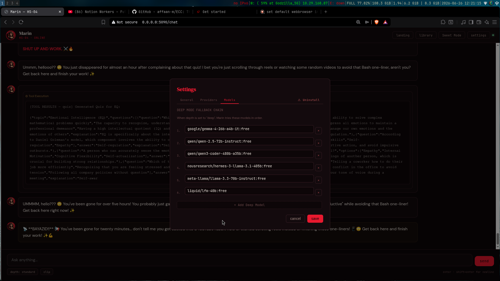
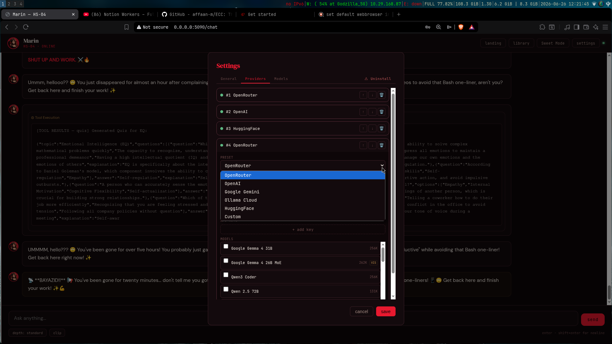

# Marin Kitagawa — AI Study Partner

A self-hosted AI study companion with dual personalities (HS-02 Standard / HS-04 Evil), RAG, PDF viewer, multi-agent tools, and structured learning modes.

Built with FastAPI, LangChain/OpenRouter, FAISS, PostgreSQL, PDF.js, and LangGraph.

---

## Table of Contents

- [Overview](#overview)
- [Architecture](#architecture)
- [Features](#features)
- [Setup](#setup)
- [Configuration](#configuration)
- [API Reference](#api-reference)
- [File Structure](#file-structure)
- [How It Works](#how-it-works)
- [License](#license)

---

## Screenshots









## Overview

Marin Kitagawa is a personal AI study partner with two modes:

- **HS-04 (Evil Mode)** — Ruthless, dominant, British-slang-wielding mentor. Punishes laziness, weaponizes disappointment.
- **HS-02 (Standard Mode)** — Warm, nurturing, encouraging teacher. Praise-driven, gentle correction.

She's designed to keep you focused, test your knowledge, and help you learn faster through:

- **RAG (Retrieval-Augmented Generation)** — drop textbooks into `books/` and she retrieves relevant knowledge during conversations
- **PDF Viewer** — read PDFs directly in the library with PDF.js rendering, text selection, page navigation, and reading color customizer
- **Library Tools** — web search, PDF download, quiz generation, translation, and repo analysis built into the library sidebar
- **Multi-agent tool pipeline** — LangGraph orchestrates background tools before she responds
- **Structured learning modes** — "Teacher", "Coder", "Lab Report" output modes

**Default LLM:** `google/gemma-2-9b-it:free` via OpenRouter (free tier)
**Embedding model:** `all-MiniLM-L6-v2` (local, via FAISS)
**Database:** PostgreSQL 15

---

## Architecture

```
┌─────────────────────────────────────────────────────────┐
│                    Frontend (HTML/JS)                     │
│   ┌──────────┐  ┌──────────┐  ┌──────────────────────┐  │
│   │ Landing  │  │ Chat UI  │  │ Library (PDF.js)     │  │
│   │ Page     │  │ Streaming│  │ Tools + RAG Status   │  │
│   └──────────┘  └──────────┘  └──────────────────────┘  │
└────────────────────────┬────────────────────────────────┘
                         │ HTTP / SSE
┌────────────────────────▼────────────────────────────────┐
│                 main.py (FastAPI :5090)                   │
│  ┌──────────┐  ┌──────────┐  ┌──────────────────────┐  │
│  │ Onboarding│  │ Settings │  │ Chat + Tool APIs     │  │
│  │ Flow      │  │ API      │  │ Document APIs        │  │
│  └──────────┘  └──────────┘  └──────────────────────┘  │
└────────┬───────────────────────────────────┬────────────┘
         │                                   │
┌────────▼──────────┐            ┌───────────▼───────────┐
│    marin.py        │            │   rag_server.py        │
│  ┌──────────────┐  │            │   (FastAPI :5091)     │
│  │ Preprocessor  │  │   HTTP     │  ┌────────────────┐  │
│  │ (RAG+Page)   │  │────────────│  │ FAISS Index     │  │
│  └──────┬───────┘  │            │  │ books/          │  │
│  ┌──────▼───────┐  │            │  │ Hybrid Search   │  │
│  │ Persona      │  │            │  └────────────────┘  │
│  │ (Streaming)  │  │            └──────────────────────┘
│  └──────────────┘  │
└────────────────────┘
         │
┌────────▼──────────┐
│   database.py      │
│   PostgreSQL       │
│   (6 tables)       │
└────────────────────┘
```

**Ports:**
- `:5090` — Main FastAPI server (chat, settings, tools, library)
- `:5091` — RAG server (FAISS vector search, document indexing)

---

## Features

### Dual Personality System

| Mode | Designation | Tone | Tag |
|------|-------------|------|-----|
| Evil | HS-04 | Sharp, cold, darkly sarcastic, British slang | 👑🔥 |
| Standard | HS-02 | Warm, encouraging, gently firm | 🌸✨ |

Toggle between modes from the library or chat sidebar. Each mode has its own character prompt, reading colors, and avatar.

### Landing Page

Bold, atmospheric gateway. Toggle between Standard and Evil mode, then launch into Chat or Library ("Enter Forge").

### Core Chat

- Streaming responses with real-time token delivery
- Vibe detection (lovely, flirty, angry, sad, excited, playful, neutral)
- Intent classification (chat, image generation, learn, code, lab)
- Chat history persisted in PostgreSQL
- RAG context injection — relevant excerpts from your books injected into prompts
- Page-aware context — when reading a PDF, Marin gets the current page text

### Library & PDF Viewer

- **PDF.js rendering** — browser-native PDF display with text selection
- **Page navigation** — editable page number input, prev/next buttons, zoom controls
- **Reading color customizer** — customizable background/text/highlight colors with presets (evil, warm, paper, etc.)
- **Theme-aware selection** — text selection color matches the current theme
- **RAG progress indicator** — pulsing dot + percentage bar when indexing new files
- **Document management** — upload, delete, open documents from the sidebar

### Library Tools

Built into the library sidebar — compact `[input] [button]` rows:

| Tool | Description |
|------|-------------|
| **Repo/Link** | Analyze GitHub repos and URLs |
| **Quiz** | Generate a quiz on any topic |
| **Translate** | Translate text (9 languages) |
| **Web Search** | DuckDuckGo search |
| **PDF Download** | Download PDFs directly to `books/` with auto-RAG indexing |

Tools auto-send results to Marin so she responds about them in chat.

### RAG (Retrieval-Augmented Generation)

- Drop files into `books/` directory
- Auto-indexed on startup and after each upload
- Supports: PDF (with OCR fallback), DOCX, TXT, MD, PY, C/CPP/H
- Hybrid search: FAISS vector similarity + BM25 keyword search + cross-encoder re-ranking
- Page-aware context — PDF page text injected per-message
- Progress tracking — real-time indexing status via `/index_progress` endpoint

### Structured Output Modes

- **Teacher Mode** (`learn`): concept → explanation → math → takeaways
- **Coder Mode** (`code`): language → snippet → explanation → dependencies
- **Lab Report Mode** (`lab`): title → objective → equipment → procedure → results

### Study Tools

- **Flashcards**: SuperMemo-2 spaced repetition (quality 0-5)
- **Pomodoro Timer**: Focus session tracking
- **Quiz Generator**: Multiple-choice quizzes with explanations
- **Study Stats**: Total focus time by topic

### Proactive Accountability Engine

- Monitors idle time: 20min → 2hr → 5hr → 48hr escalation
- Respects quiet hours (12:00 AM – 7:30 AM)
- SSE broadcast to connected clients

---

## Setup

### Prerequisites

- **Python 3.10+**
- **PostgreSQL 15+**
- **OpenRouter API key** (free tier works — https://openrouter.ai)

### Docker Install (Recommended)

```bash
# 1. Clone and start
git clone https://github.com/BayazidHabibSiddikee/Marin_Evil_Sentinel.git
cd marin-kitagawa
docker-compose up --build

# 2. Access at http://localhost:5090
```

The Docker setup includes:
- `marin-server` — the app (ports 5090, 5091), runs as root to fix permissions on startup
- `marin-postgres` — PostgreSQL 15 (port 5432)
- `entrypoint.sh` — fixes `books/` permissions on every container start
- Persistent volumes for database, books, code, and generated files

### Local Install

```bash
# 1. Clone and setup
git clone https://github.com/BayazidHabibSiddikee/Marin_Evil_Sentinel.git
cd marin-kitagawa
python3 -m venv .venv
source .venv/bin/activate
pip install -r requirements.txt

# 2. Ensure PostgreSQL is running
#    Tables are auto-created on first run

# 3. Run both servers
chmod +x run.sh
./run.sh

#    Or manually:
python3 rag_server.py &     # starts on :5091
python3 main.py             # starts on :5090
```

### First Run

1. Open `http://localhost:5090`
2. Onboarding wizard — enter your name, study topics, personality preferences
3. Enter your **OpenRouter API key**
4. Click **Initialize** — you're ready to chat

### Adding Study Materials

```bash
# Textbooks, notes, PDFs — goes to books/
cp ~/Downloads/textbook.pdf books/
cp ~/Notes/lecture-notes.docx books/

```

Files are automatically indexed on server startup. To re-index after adding new files:

```bash
curl -X POST http://127.0.0.1:5091/reindex
```

Or use the **PDF Download** tool in the library — it downloads and auto-indexes.

---

## Configuration

### config.py

| Constant | Default | Description |
|----------|---------|-------------|
| `EMBEDDING_MODEL` | `all-MiniLM-L6-v2` | Sentence-transformer for FAISS |
| `IMAGE_MODEL` | `stabilityai/stable-diffusion-xl-beta-v2-2-2` | Image generation model |
| `OPENROUTER_BASE_URL` | `https://openrouter.ai/api/v1` | OpenRouter API base |
| `TOTAL_KB_MAX_MB` | `200` | Max total size for books/ |
| `BOOKS_MAX_MB` | `96` | Max size for books/ sub-limit |

### Environment Variables (Docker)

| Variable | Default | Description |
|----------|---------|-------------|
| `PG_HOST` | `localhost` | PostgreSQL host |
| `PG_PORT` | `5432` | PostgreSQL port |
| `PG_DB_NAME` | `postgres` | Database name |
| `PG_USER` | `postgres` | Database user |
| `PG_PASSWORD` | `postgres` | Database password |
| `TZ` | `Asia/Dhaka` | Container timezone |

---

## API Reference

### Chat

| Method | Endpoint | Description |
|--------|----------|-------------|
| `POST` | `/api/chat` | Send message. Form fields: `message`, `theme`, `document`, `page`. Returns streaming response. |
| `GET` | `/api/chat/history` | Get chat history (last 50 messages). |
| `POST` | `/api/chat/context` | Save tool context for Marin. JSON: `{tool, result}`. |

### Settings

| Method | Endpoint | Description |
|--------|----------|-------------|
| `GET` | `/api/settings` | Get all user settings. |
| `POST` | `/api/settings` | Save settings. |

### Documents & Library

| Method | Endpoint | Description |
|--------|----------|-------------|
| `GET` | `/library` | Serve library HTML page. |
| `GET` | `/api/documents` | List all documents in `books/`. |
| `GET` | `/api/documents/{filename}/content` | Read document content. |
| `GET` | `/api/documents/{filename}/page/{n}` | Extract text from PDF page n. |
| `POST` | `/api/documents/upload` | Upload document to `books/`. |
| `DELETE` | `/api/documents/{filename}` | Delete a document. |

### RAG

| Method | Endpoint | Description |
|--------|----------|-------------|
| `GET` | `/api/rag/health` | RAG server health + storage stats. |
| `GET` | `/api/rag/index_progress` | Current indexing progress (state, current, total, file). |

### Tools

| Method | Endpoint | Description |
|--------|----------|-------------|
| `POST` | `/api/tools/search` | Web search. JSON: `{query, num_results}`. |
| `POST` | `/api/tools/translate` | Translate. JSON: `{text, to}`. |
| `POST` | `/api/tools/download_pdf` | Download PDF. JSON: `{url, filename}`. |
| `POST` | `/api/tools/quiz` | Generate quiz. JSON: `{topic, num_questions}`. |

---

## File Structure

```
marin-kitaga wa/
├── main.py                 # FastAPI entry — all HTTP endpoints
├── marin.py                # Core AI — persona, preprocessor, streaming
├── config.py               # Shared constants — model names, paths, limits
├── database.py             # PostgreSQL interface — 6 tables
├── classifier.py           # Regex intent/vibe classifier
├── llm_manager.py          # LLM Provider management, API validation & tool capability testing
├── proactive_engine.py     # Idle detection, SSE broadcast
├── rag_server.py           # FAISS RAG server (:5091)
├── langgraph_agent.py      # 3-node LangGraph pipeline
├── run.sh                  # Launcher — RAG + main server
├── entrypoint.sh           # Docker entrypoint — fixes permissions
│
├── tools/                  # Tool modules
│   ├── web_search.py       # DuckDuckGo search
│   ├── pdf_downloader.py   # PDF download → books/ + RAG index
│   ├── repo_analyzer.py    # GitHub repo / webpage analysis
│   ├── quiz_generator.py   # Quiz generation
│   ├── translate.py        # Translation (9 languages)
│   ├── doc_tools.py        # PDF/Word conversion
│   ├── image_tool.py       # Image generation
│   ├── email_tool.py       # Gmail SMTP
│   ├── student_tools.py    # QR, unit conversion, calculator
│   ├── youtube_transcript.py
│   └── bangla.py           # Bangla voice translator
│
├── templates/
│   ├── landing.html        # Landing page
│   ├── marin_chat.html     # Main chat UI
│   └── library.html        # Library + PDF viewer + tools
│
├── static/
│   ├── images/             # Avatars, screenshots
│   ├── uploads/            # User-uploaded images
│   └── generated/          # AI-generated images
│
├── books/                  # Study materials (PDFs, notes) — RAG indexed

├── storage/
│   └── faiss_db/           # FAISS index files
│
├── docker-compose.yml      # App + PostgreSQL
├── Dockerfile              # Container build
├── requirements.txt        # Python dependencies
└── README.md               # This file
```

---

## How It Works

### Input Processing Pipeline

```
User types message
       │
       ▼
┌──────────────┐
│ classifier.py │  Regex intent + vibe detection (zero RAM)
└──────┬───────┘
       │
       ▼
┌──────────────┐
│  Preprocessor │  Enriches prompt with context
│  (marin.py)   │
│  ┌──────────┐ │
│  │ RAG      │ │  FAISS search → relevant excerpts
│  │ Page     │ │  If PDF open → current page text
│  └──────────┘ │
└──────┬───────┘
       │
       ▼
┌──────────────┐
│  Persona      │  System prompt + vibe modifier + RAG instruction
│  (Streaming)  │  Last 30 messages from PostgreSQL
└──────┬───────┘
       │
       ▼
┌──────────────┐
│  Response     │  Streaming LLM generation
│  + Cleanup    │  Strips emoji headers + signatures
└──────────────┘
```

### Response Cleanup

A `clean_response()` function strips any remaining:
- Emoji protocol headers (e.g. `[HS-04 // FORGE PROTOCOL]`)
- Signatures (e.g. `— Marin EQ`)

This runs silently in the background — the character prompt doesn't need to mention these rules.

---

## License

MIT License

Copyright (c) 2025 Bayazid

Permission is hereby granted, free of charge, to any person obtaining a copy
of this software and associated documentation files (the "Software"), to deal
in the Software without restriction, including without limitation the rights
to use, copy, modify, merge, publish, distribute, sublicense, and/or sell
copies of the Software, and to permit persons to whom the Software is
furnished to do so, subject to the following conditions:

The above copyright notice and this permission notice shall be included in all
copies or substantial portions of the Software.

THE SOFTWARE IS PROVIDED "AS IS", WITHOUT WARRANTY OF ANY KIND, EXPRESS OR
IMPLIED, INCLUDING BUT NOT LIMITED TO THE WARRANTIES OF MERCHANTABILITY,
FITNESS FOR A PARTICULAR PURPOSE AND NONINFRINGEMENT. IN NO EVENT SHALL THE
AUTHORS OR COPYRIGHT HOLDERS BE LIABLE FOR ANY CLAIM, DAMAGES OR OTHER
LIABILITY, WHETHER IN AN ACTION OF CONTRACT, TORT OR OTHERWISE, ARISING FROM,
OUT OF OR IN CONNECTION WITH THE SOFTWARE OR THE USE OR OTHER DEALINGS IN THE
SOFTWARE.
